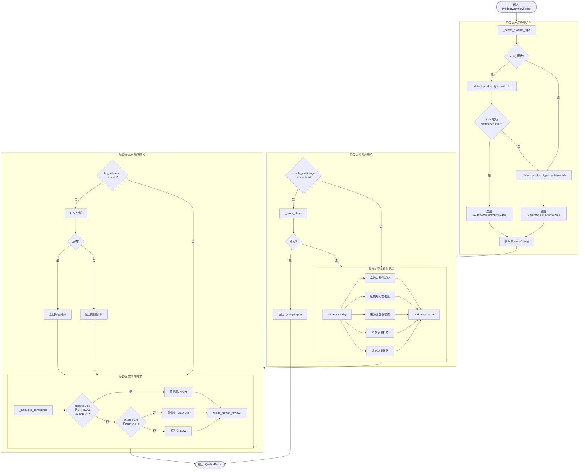
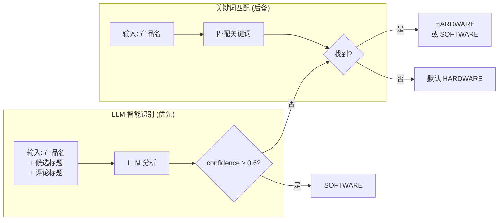
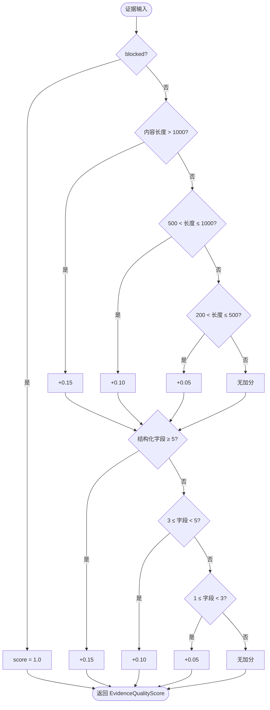
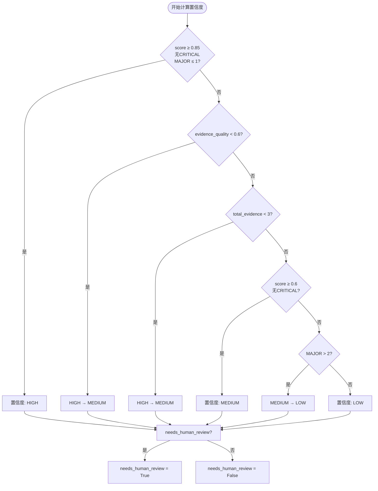
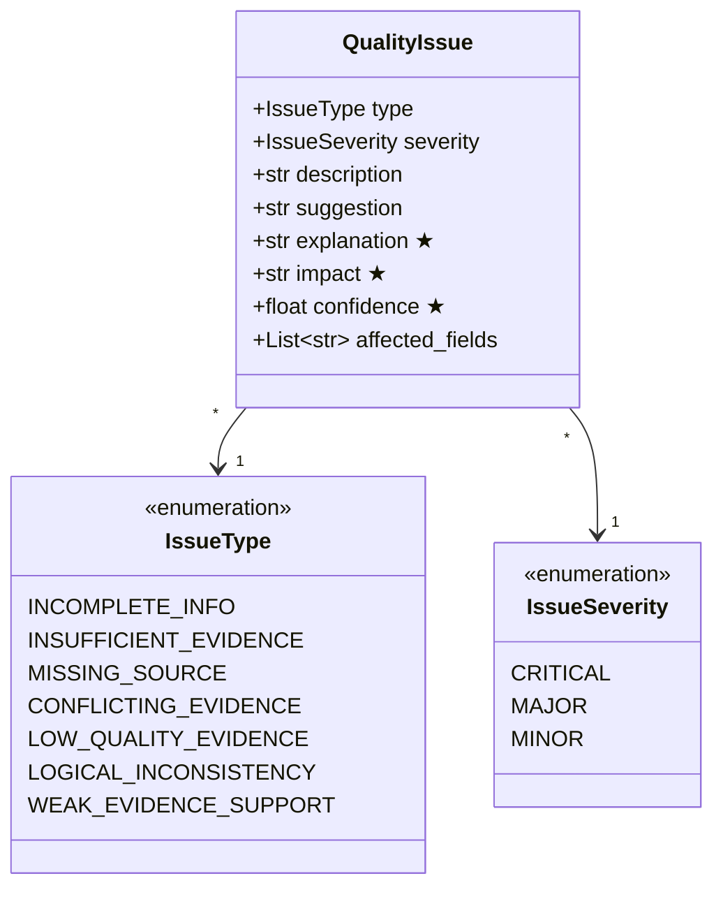
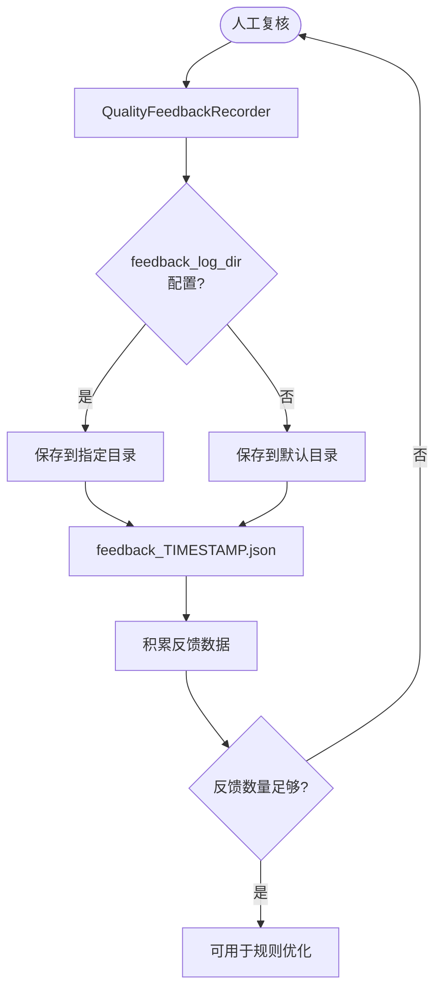
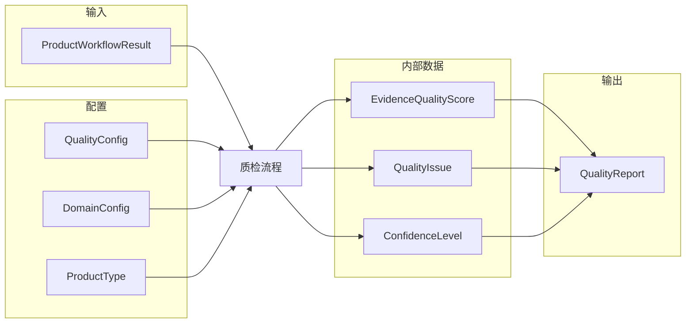

# Quality Agent 工作流程

## 整体流程图

```mermaid
flowchart TD
    Start([输入: ProductWorkflowResult]) --> Stage1

    subgraph Stage1["阶段1: 产品类型识别"]
        A1[_detect_product_type]
        A1 --> A2{config 提供?}
        A2 -->|是| A3[_detect_product_type_with_llm]
        A2 -->|否| A4[_detect_product_type_by_keywords]
        A3 --> A5{LLM 成功<br/>confidence ≥ 0.6?}
        A5 -->|是| A6[返回 HARDWARE/SOFTWARE]
        A5 -->|否| A4
        A4 --> A7[返回 HARDWARE/SOFTWARE]
        A6 --> A8[获取 DomainConfig]
        A7 --> A8
    end

    A8 --> Stage2

    subgraph Stage2["阶段2: 多阶段质检"]
        B1{enable_multistage<br/>_inspection?}
        B1 -->|是| B2[_quick_check]
        B1 -->|否| Stage3
        B2 --> B3{通过?}
        B3 -->|是| End1[返回 QualityReport]
        B3 -->|否| Stage3
    end

    Stage2 --> Stage3

    subgraph Stage3["阶段3: 深度规则质检"]
        C1[inspect_quality]
        C1 --> C2[字段完整性检查]
        C1 --> C3[证据充分性检查]
        C1 --> C4[来源追溯性检查]
        C1 --> C5[冲突证据检查]
        C1 --> C6[证据质量评估]
        C2 --> C7[_calculate_score]
        C3 --> C7
        C4 --> C7
        C5 --> C7
        C6 --> C7
    end

    Stage3 --> Stage4

    subgraph Stage4["阶段4: LLM 增强质检"]
        D1{llm_enhanced<br/>_inspect?}
        D1 -->|是| D2[LLM 分析]
        D1 -->|否| Stage5
        D2 --> D3{成功?}
        D3 -->|是| D4[返回增强结果]
        D3 -->|否| D5[回退规则引擎]
        D4 --> Stage5
        D5 --> Stage5
    end

    Stage4 --> Stage5

    subgraph Stage5["阶段5: 置信度判定"]
        E1[_calculate_confidence]
        E1 --> E2{score ≥ 0.85<br/>无CRITICAL<br/>MAJOR ≤ 1?}
        E2 -->|是| E3[置信度: HIGH]
        E2 -->|否| E4{score ≥ 0.6<br/>无CRITICAL?}
        E4 -->|是| E5[置信度: MEDIUM]
        E4 -->|否| E6[置信度: LOW]
        E3 --> E7[needs_human_review?]
        E5 --> E7
        E6 --> E7
    end

    Stage5 --> End2([输出: QualityReport])

    End1 --> End2
```

## 产品类型识别流程

```mermaid
flowchart LR
    subgraph LLM识别["LLM 智能识别 (优先)"]
        L1[输入: 产品名<br/>+ 候选标题<br/>+ 评论标题] --> L2[LLM 分析]
        L2 --> L3{confidence ≥ 0.6?}
    end

    subgraph Keyword["关键词匹配 (后备)"]
        K1[输入: 产品名] --> K2[匹配关键词]
        K2 --> K3{找到?}
    end

    L3 -->|是| R1[SOFTWARE]
    L3 -->|否| K3
    K3 -->|是| R2[HARDWARE<br/>或 SOFTWARE]
    K3 -->|否| R3[默认 HARDWARE]
```

## 证据质量评估

```mermaid
flowchart TD
    Start([证据输入]) --> Blocked{blocked?}

    Blocked -->|是| B1[score = 1.0]
    Blocked -->|否| Content{内容长度 > 1000?}
    Content -->|是| C1[+0.15]
    Content -->|否| Content2{500 < 长度 ≤ 1000?}
    Content2 -->|是| C2[+0.10]
    Content2 -->|否| Content3{200 < 长度 ≤ 500?}
    Content3 -->|是| C3[+0.05]
    Content3 -->|否| C4[无加分]

    C1 --> Struct{结构化字段 ≥ 5?}
    C2 --> Struct
    C3 --> Struct
    C4 --> Struct

    Struct -->|是| S1[+0.15]
    Struct -->|否| Struct2{3 ≤ 字段 < 5?}
    Struct2 -->|是| S2[+0.10]
    Struct2 -->|否| Struct3{1 ≤ 字段 < 3?}
    Struct3 -->|是| S3[+0.05]
    Struct3 -->|否| S4[无加分]

    B1 --> End([返回 EvidenceQualityScore])
    S1 --> End
    S2 --> End
    S3 --> End
    S4 --> End
```

## 置信度判定

```mermaid
flowchart TD
    Start([开始计算置信度]) --> Check1

    Check1{score ≥ 0.85<br/>无CRITICAL<br/>MAJOR ≤ 1?}
    Check1 -->|是| HIGH[置信度: HIGH]
    Check1 -->|否| Check2

    Check2{evidence_quality < 0.6?}
    Check2 -->|是|降级1[ HIGH → MEDIUM]
    Check2 -->|否| Check3

    Check3{total_evidence < 3?}
    Check3 -->|是|降级2[ HIGH → MEDIUM]
    Check3 -->|否| Check4

    Check4{score ≥ 0.6<br/>无CRITICAL?}
    Check4 -->|是| MEDIUM[置信度: MEDIUM]
    Check4 -->|否| Check5

    Check5{MAJOR > 2?}
    Check5 -->|是|降级3[ MEDIUM → LOW]
    Check5 -->|否| LOW[置信度: LOW]

    HIGH --> Review[needs_human_review?]
    降级1 --> Review
    MEDIUM --> Review
    降级2 --> Review
    降级3 --> Review
    LOW --> Review

    Review -->|是| Y[needs_human_review = True]
    Review -->|否| N[needs_human_review = False]
```

## QualityIssue 增强结构

```mermaid
classDiagram
    class QualityIssue {
        +IssueType type
        +IssueSeverity severity
        +str description
        +str suggestion
        +str explanation ★
        +str impact ★
        +float confidence ★
        +List~str~ affected_fields
    }

    class IssueType {
        <<enumeration>>
        INCOMPLETE_INFO
        INSUFFICIENT_EVIDENCE
        MISSING_SOURCE
        CONFLICTING_EVIDENCE
        LOW_QUALITY_EVIDENCE
        LOGICAL_INCONSISTENCY
        WEAK_EVIDENCE_SUPPORT
    }

    class IssueSeverity {
        <<enumeration>>
        CRITICAL
        MAJOR
        MINOR
    }

    QualityIssue "*" --> "1" IssueType
    QualityIssue "*" --> "1" IssueSeverity
```

## 持续学习机制

```mermaid
flowchart TD
    A([人工复核]) --> B[QualityFeedbackRecorder]
    B --> C{feedback_log_dir<br/>配置?}
    C -->|是| D[保存到指定目录]
    C -->|否| E[保存到默认目录<br/./quality_feedback/]
    D --> F[feedback_TIMESTAMP.json]
    E --> F
    F --> G[积累反馈数据]
    G --> H{反馈数量足够?}
    H -->|是| I[可用于规则优化]
    H -->|否| A
```

## 数据流总览

```mermaid
flowchart LR
    subgraph Input["输入"]
        I1[ProductWorkflowResult]
    end

    subgraph Output["输出"]
        O1[QualityReport]
    end

    subgraph Config["配置"]
        C1[QualityConfig]
        C2[DomainConfig]
        C3[ProductType]
    end

    subgraph Internal["内部数据"]
        I2[EvidenceQualityScore]
        I3[QualityIssue]
        I4[ConfidenceLevel]
    end

    I1 --> A[质检流程]
    C1 --> A
    C2 --> A
    C3 --> A
    A --> I2
    A --> I3
    A --> I4
    I2 --> O1
    I3 --> O1
    I4 --> O1
```
